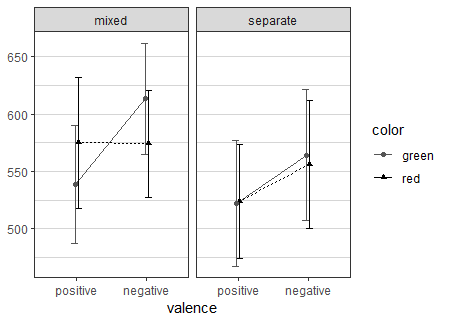
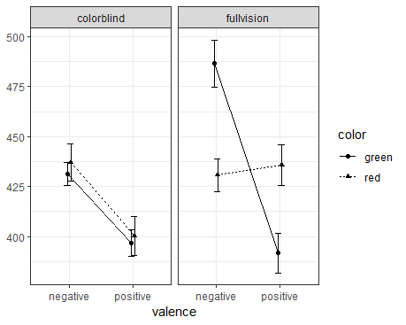
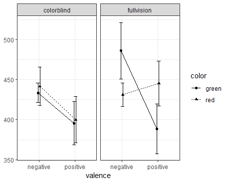

### Usage example: pipeline from raw data to reportable statistics


You can completely ignore the details of the function below: it serves merely to simulate example data.

```R
next_subject = function(sub_num) {
    N = 150
    sub_dat = data.frame(
        subject_num = toString(sub_num),
        condition = sample(c('fullvision', 'colorblind'), 1),
        rt = rnorm(n = N, mean = 400, sd = 150),
        response = sample(
            c(rep('correct', 9), 'incorrect', 'tooslow'),
            size = N,
            replace = TRUE
        ),
        color = sample(c('red', 'green'), size = N, replace = TRUE),
        valence = sample(
            c('positive', 'negative'),
            size = N,
            replace = TRUE
        )
    )
    if (sub_dat$condition[1] == 'fullvision') {
        green_neg = (sub_dat$color == 'green' &
                         sub_dat$valence == 'negative')
        sub_dat$rt[green_neg] = sub_dat$rt[green_neg] + rnorm(n = length(sub_dat$rt[green_neg]),
                                                              mean = 43,
                                                              sd = 30)
        sub_dat$response[green_neg] = sample(
            c(rep('correct', 6), 'incorrect', 'tooslow'),
            size = length(sub_dat$response[green_neg]),
            replace = TRUE
        )
        red_pos = (sub_dat$color == 'red' &
                       sub_dat$valence == 'positive')
        sub_dat$rt[red_pos] = sub_dat$rt[red_pos] + rnorm(n = length(sub_dat$rt[red_pos]),
                                                          mean = 37,
                                                          sd = 30)
        sub_dat$response[red_pos] = sample(
            c(rep('correct', 6), 'incorrect', 'tooslow'),
            size = length(sub_dat$response[red_pos]),
            replace = TRUE
        )
    }
    neg = (sub_dat$valence == 'negative')
    sub_dat$rt[neg] = sub_dat$rt[neg] + rnorm(n = length(sub_dat$rt[neg]),
                                              mean = 40,
                                              sd = 25)
    sub_dat$response[neg] = sample(
        c(rep('correct', 6), 'incorrect', 'tooslow'),
        size = length(sub_dat$response[neg]),
        replace = TRUE
    )
    return(sub_dat)
}
```
The variable below simulates file names
```R
filenames = 1:60
```

The function above will simulate data from participants who complete a task with positive and negative words (e.g. "happy", "peaceful" or "terror", "evil") displayed in green or red, classifying each word with key presses according to valence (positive vs. negative). The hypotheses are that (1) negative words have slower responses in general, and (2) positive words displayed in red and negative words displayed in green have slower responses. Error rates should follow similar pattern (i.e. more incorrect responses are expected in cases where slower responses are expected). What's more, this crazy experiment took color-blind participants in one group, in addition to a group with full color vision. In the former case, color effects should be absent: no Valence x Color interaction in this group.

You can check how a hypothetical (randomly generated) participant data looks like:
```R
head(next_subject())
```

To illustrate a real case, let's say you have data files from an experiment, and the file names start as "color_exp", and they are all ".txt". You can collect all of them from a given folder. First, you need to set the right path with `setwd("whatever/path")`. You could set the path to the script's directory with `setwd(script_path())`, if the files are there. Then you can collect all file names with `filenames = list.files(pattern = "^color_exp.*txt$")`. (Here for the simulation I just have the `filenames` assigned as numbers, see above.)

Now loop through all data files to collect the data.

```R
# first, just remove the `subjects_merged` if already exists
# (in case the loop below has already been run before)
if (exists("subjects_merged")) { rm(subjects_merged) }

# now the loop
for (file_name in filenames) {
    subject_data = next_subject(file_name)
    # with real data, this would be e.g.:
    # subject_data = read.table(file_name, stringsAsFactors=F, fill=T, header=T)
    
    # print current file name - just to monitor the process
    cat(file_name, ' ')
    
    # now aggregate rt data per type
    rts = aggr_neat(
        subject_data,
        rt,
        group_by = c('color', 'valence'),
        method = mean,
        prefix = 'rt'
    )
    # same with error rates; get ratio of 'incorrect'
    ers = aggr_neat(
        subject_data,
        response,
        group_by = c('color', 'valence'),
        method = 'incorrect',
        prefix = 'er',
        filt = (response %in% c('correct', 'incorrect'))
    )
    # transpose to get the subject's data in one line
    subject_line = table_neat(list(rts, ers), transpose = TRUE)
    # add the subject_id and condition to the beginning
    subject_line = data.frame(
        subject_id = subject_data$subject_num[1],
        condition = subject_data$condition[1],
        subject_line
    )
    
    # merge aggregated subject data
    if (!exists("subjects_merged")) {
        # if doesn't yet exist, create first line
        subjects_merged = subject_line
    } else {
        # if exists, add the next lines
        subjects_merged = rbind(subjects_merged, subject_line)
        # note: if some data may be discrepant for some participants (e.g., some
        # participants are tested with blue and yellow colors too), you can use
        # rbind.fill from the 'plyr' library to fill in missing data with NAs
    }
}
```

Ta-da! The data is ready for analysis.

At this point you might want to list column names, for convenient copy-pasting: `names(subjects_merged)`. (But here I already copied them for the functions below.)

Now let's plot all the data.

```R
plot_neat(
    data_per_subject = subjects_merged,
    values = c(
        'rt_green_negative',
        'rt_green_positive',
        'rt_red_negative',
        'rt_red_positive'
    ),
    within_ids = list(
        color = c('green', 'red'),
        valence = c('positive', 'negative')
    ),
    between_vars = 'condition'
)
```



All seems as expected. But how sure are we about these apparent differences? Even before statistical comparisons, we can take a look at the 95% CIs of the means.

```R
plot_neat(
    data_per_subject = subjects_merged,
    values = c(
        'rt_green_negative',
        'rt_green_positive',
        'rt_red_negative',
        'rt_red_positive'
    ),
    within_ids = list(
        color = c('green', 'red'),
        valence = c('positive', 'negative')
    ),
    between_vars = 'condition',
    eb_method = mean_ci
)
```



Seems convincing. Still, we can also look at medians and median absolute deviation to control for outliers and see whether the picture changes then.

```R
plot_neat(
    data_per_subject = subjects_merged,
    values = c(
        'rt_green_negative',
        'rt_green_positive',
        'rt_red_negative',
        'rt_red_positive'
    ),
    within_ids = list(
        color = c('green', 'red'),
        valence = c('positive', 'negative')
    ),
    between_vars = 'condition',
    method = median,
    eb_method = mad
)
```



Pretty much the same.

Now let's do an actual test: ANOVA on RTs for the Color x Valence x Group interaction. (I omit BFs here for speed.)

```R
anova_neat(
    subjects_merged,
    values = c(
        'rt_green_negative',
        'rt_green_positive',
        'rt_red_negative',
        'rt_red_positive'
    ),
    within_ids = list(
        color = c('green', 'red'),
        valence = c('positive', 'negative')
    ),
    between_vars = 'condition',
    bf_added = FALSE
)
```

My output is:
> F(1,58) = 36.75, p < .001, ηp2 = .388, 90% CI [.223, .511]. (condition)  
> F(1,58) = 0.04, p = .834, ηp2 = .001, 90% CI [0, .039]. (color)  
> F(1,58) = 138.66, p < .001, ηp2 = .705, 90% CI [.591, .770]. (valence)  
> F(1,58) = 3.14, p = .081, ηp2 = .051, 90% CI [0, .164]. (color × condition)  
> F(1,58) = 1.86, p = .178, ηp2 = .031, 90% CI [0, .132]. (condition × valence)  
> F(1,58) = 29.98, p < .001, ηp2 = .341, 90% CI [.178, .470]. (color × valence)  
> F(1,58) = 54.17, p < .001, ηp2 = .483, 90% CI [.322, .592]. (color × condition × valence)

Without going into details, the three-way interaction is significant. You follow up (as preregistered of course) with two separate ANOVAs to show the absence of Color x Valence interaction for color-blind group, and its presence in the full vision group.

```R
anova_neat(
    subjects_merged[subjects_merged$condition == 'colorblind', ],
    values = c(
        'rt_green_negative',
        'rt_green_positive',
        'rt_red_negative',
        'rt_red_positive'
    ),
    within_ids = list(
        color = c('green', 'red'),
        valence = c('positive', 'negative')
    ),
    bf_added = T
)
```

My output is:
> F(1,36) = 1.35, p = .253, ηp2 = .036, 90% CI [0, .173], BF01 = 2.86. (color)  
> F(1,36) = 68.31, p < .001, ηp2 = .655, 90% CI [.481, .744], BF10 = 1.48 × 10^13. (valence)  
> F(1,36) = 0.08, p = .780, ηp2 = .002, 90% CI [0, .074], BF01 = 4.06. (color × valence)

As expected, no significant interaction. BF also has substantial evidence here for equivalence. (If you are not convinced; just change `filenames = 1:60` in the beginning to `filenames = 1:100` or similar, and rerun the analysis with this increased sample.)

```R
anova_neat(
    subjects_merged[subjects_merged$condition == 'fullvision', ],
    values = c(
        'rt_green_negative',
        'rt_green_positive',
        'rt_red_negative',
        'rt_red_positive'
    ),
    within_ids = list(
        color = c('green', 'red'),
        valence = c('positive', 'negative')
    ),
    bf_added = T
)
```

My output is:
> F(1,22) = 2.26, p = .147, ηp2 = .093, 90% CI [0, .295], BF01 = 3.52. (color)  
> F(1,22) = 73.98, p < .001, ηp2 = .771, 90% CI [.588, .840], BF10 = 7.59 × 10^5. (valence)  
> F(1,22) = 65.91, p < .001, ηp2 = .750, 90% CI [.555, .825], BF10 = 2.58 × 10^13. (color × valence)

Interaction significant as expected.

Now to explore the interaction in the full vision group, you could do various t-tests (4 in "parallel" and even 2 "crosswise", why not), but perhaps what's interesting is to check whether there is a significant difference between red and green in case of either negative or positive words.

First, for convenience, I create a new data frame with only full vision group.

```R
subjects_fullv = subjects_merged[subjects_merged$condition == 'fullvision', ]
```

Now test red vs. green for negative words.

```R
t_neat(subjects_fullv$rt_green_negative,
       subjects_fullv$rt_red_negative,
       pair = T)
```

> t(22) = 7.13, p < .001, d = 1.49, 95% CI [0.88, 2.08], BF10 = 4.44 × 10^4.

Now red vs. green for positive words.

```R
t_neat(subjects_fullv$rt_green_positive,
       subjects_fullv$rt_red_positive,
       pair = T)
```

> t(22) = –6.55, p < .001, d = –1.37, 95% CI [–1.93, –0.79], BF10 = 1.35 × 10^4.

Both significant. All left to do is print a nice table to show means and SDs as customary.

```R
table_neat(
    list(
        aggr_neat(subjects_merged, rt_green_negative),
        aggr_neat(subjects_merged, rt_green_positive),
        aggr_neat(subjects_merged, rt_red_negative),
        aggr_neat(subjects_merged, rt_red_positive),
        aggr_neat(subjects_merged, er_green_negative),
        aggr_neat(subjects_merged, er_green_positive),
        aggr_neat(subjects_merged, er_red_negative),
        aggr_neat(subjects_merged, er_red_positive)
    ),
    group_by = 'condition'
)
```

This will produce a table as follows. (Well, this table here is formatted with Markdown notation, but the names and numbers are verbatim.)

| aggr_group | rt_green_negative | rt_green_positive | rt_red_negative | rt_red_positive | er_green_negative | er_green_positive | er_red_negative | er_red_positive |
|------------|-------------------|-------------------|-----------------|-----------------|-------------------|-------------------|-----------------|-----------------|
| colorblind | 431.25±18.05      | 396.72±20.79      | 437.00±28.63    | 400.26±29.69    | 0.15±0.07         | 0.11±0.06         | 0.14±0.06       | 0.10±0.05       |
| fullvision | 486.54±28.94      | 391.66±24.29      | 430.74±20.27    | 435.68±24.70    | 0.16±0.06         | 0.10±0.05         | 0.16±0.07       | 0.14±0.05       |


This is not so nice though: let's modify rounding of RTs to zero, and convert error rates to percentages. (For the latter, you need to use a vector input, so in this case the original column values, e.g. `subjects_merged$er_green_negative`, multiplied manually by `100`.)

Also, here I set `to_clipboard = TRUE`, which puts the table on your clipboard with plain format. This you can copy into Excel, and from that to Word, and you have the table. (Unfortunately Word doesn't produce nice table when copied there directly.)

(Note: you can also add new names for each column by the `aggr_neat`'s `new_name` parameter, but I didn't; it may be clearer to keep the original names here, and just rename them in the final table in Word.)

```R
table_neat(
    list(
        aggr_neat(subjects_merged, rt_green_negative, round_to = 0),
        aggr_neat(subjects_merged, rt_green_positive, round_to = 0),
        aggr_neat(subjects_merged, rt_red_negative, round_to = 0),
        aggr_neat(subjects_merged, rt_red_positive, round_to = 0),
        aggr_neat(subjects_merged, subjects_merged$er_green_negative * 100),
        aggr_neat(subjects_merged, subjects_merged$er_green_positive * 100),
        aggr_neat(subjects_merged, subjects_merged$er_red_negative * 100),
        aggr_neat(subjects_merged, subjects_merged$er_red_positive * 100)
    ),
    group_by = 'condition',
    to_clipboard = TRUE
)
```

| aggr_group | rt_green_negative | rt_green_positive | rt_red_negative | rt_red_positive | subjects_merged$er_green_negative * 100 | subjects_merged$er_green_positive * 100 | subjects_merged$er_red_negative * 100 | subjects_merged$er_red_positive * 100 |
|------------|:-----------------:|------------------:|-----------------|-----------------|-----------------------------------------|-----------------------------------------|---------------------------------------|---------------------------------------|
| colorblind |       431±18      |            397±21 | 437±29          | 400±30          | 14.57±6.69                              | 10.61±5.51                              | 14.13±5.97                            | 10.14±4.92                            |
| fullvision |       487±29      |            392±24 | 431±20          | 436±25          | 16.46±6.26                              | 10.38±5.22                              | 15.55±6.91                            | 13.58±5.26                            |

Voila, all done.